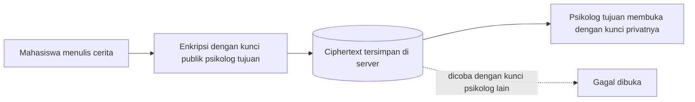

# SafeTalk


## **Aplikasi konsultasi psikologis mahasiswa dengan enkripsi RSA**

**SafeTalk** adalah aplikasi web sederhana tempat mahasiswa bisa menceritakan masalahnya kepada psikolog kampus. Isi cerita dikunci dengan RSA sebelum dikirim, sehingga hanya psikolog yang dituju (dan penulis ceritanya sendiri) yang bisa membacanya. Algoritma RSA ditulis sendiri dari nol **tanpa library atau framework kriptografi**.

## Kelompok 15

| Nama | NRP |
| --- | --- |
| Nadia Kirana Afifah | 5027241005 |
| Clarissa Aydin Rahmazea | 5027241014 |
| Ananda Widi Alrafi | 5027241076 |

## Latar belakang

Mahasiswa bisa mengalami berbagai masalah, seperti tekanan akademik, stres karena tugas dan kuliah, masalah pertemanan, masalah keluarga, kecemasan menghadapi masa depan, burnout, dan kesulitan beradaptasi dengan lingkungan kampus.

Banyak yang ragu mencari bantuan karena takut cerita pribadi atau identitasnya diketahui orang lain. Dalam konsultasi psikologis, informasi yang dibagikan sangat pribadi, sehingga kerahasiaan komunikasi antara mahasiswa dan psikolog menjadi hal yang penting. RSA dipakai untuk melindungi isi pesan konsultasi selama dikirim dari mahasiswa ke psikolog.

## Fitur

- **Banyak psikolog, kunci masing-masing:** Setiap psikolog yang diaktifkan memiliki pasangan kunci RSA 1024 bit sendiri.
- **Cerita dikunci untuk satu psikolog:** Mahasiswa memilih psikolog tujuan, dan hanya kunci privat psikolog itu yang bisa membukanya. Psikolog lain tidak bisa.
- **Nama samaran:** Mahasiswa bebas memakai nama panggilan atau nama samaran.
- **Cerita saya:** Penulis bisa membaca ulang ceritanya sendiri lewat salinan yang dienkripsi dengan kunci miliknya.
- **Kotak masuk per psikolog:** Setiap psikolog hanya melihat cerita yang ditujukan kepadanya.
- **Uji kerahasiaan:** Fitur untuk mencoba membuka paksa sebuah cerita dengan kunci psikolog lain. Hasilnya gagal, dan itu membuktikan kerahasiaan berasal dari enkripsi, bukan sekadar filter tampilan.
- **Lihat data di server:** Pengguna bisa melihat bahwa yang tersimpan dan terkirim hanyalah teks acak (ciphertext).
- **Teks asli tidak disimpan:** Setelah dibuka, teks asli hanya ada di memori halaman. Yang tersimpan tetap ciphertext.

## Cara kerja



1. **Aktivasi akun psikolog.** Aplikasi membuat pasangan kunci RSA 1024 bit untuk psikolog. Kunci publik dipakai untuk mengenkripsi, kunci privat dipakai untuk mendekripsi.
2. **Pengiriman cerita.** Teks diubah ke byte, diberi padding acak, dipecah menjadi blok, lalu setiap blok dienkripsi dengan kunci publik psikolog tujuan.
3. **Penyimpanan.** Yang tersimpan hanya ciphertext. Satu salinan dienkripsi untuk psikolog, satu salinan lagi dienkripsi dengan kunci penulis agar penulis bisa membaca ulang.
4. **Pembukaan pesan.** Psikolog mendekripsi setiap blok dengan kunci privatnya, membuang padding, lalu menggabungkan hasilnya menjadi teks asli.

### Detail implementasi RSA

Semua ditulis manual dengan `BigInt` JavaScript, tanpa library kriptografi:

| Tahap | Implementasi |
| --- | --- |
| Pembangkitan bilangan prima | Kandidat acak, lalu diuji dengan Miller-Rabin (24 putaran) |
| Modulus dan totien | `n = p x q`, `φ(n) = (p-1)(q-1)` |
| Eksponen publik | `e = 65537`, dengan syarat `FPB(e, φ(n)) = 1` |
| Eksponen privat | `d = e^-1 mod φ(n)` dengan algoritma Euclid yang diperluas |
| Enkripsi dan dekripsi | `c = m^e mod n` dan `m = c^d mod n` dengan modular exponentiation (square and multiply) |
| Padding | PKCS#1 v1.5 tipe 2: `00 02 [byte acak non-nol] 00 [data]` |
| Pesan panjang | Dipecah menjadi blok sebesar `(panjang n dalam byte) - 11` |

Satu-satunya fungsi bawaan browser yang dipakai adalah `crypto.getRandomValues`, sebagai sumber bilangan acak.

## Cara menjalankan

Tidak perlu instalasi paket apa pun. Pilih salah satu cara.

### Cara 1: Klik dua kali

Buka file `index.html` di browser (Chrome, Edge, atau Firefox).

### Cara 2: Lewat `run.py` (disarankan di IDE)

Butuh Python 3. Di terminal, dari folder yang berisi `index.html`:

```bash
python run.py
```

Browser terbuka otomatis di `http://localhost:8000/index.html`. Tekan `Ctrl+C` di terminal untuk berhenti.

### Cara 3: Lewat `jalankan.bat` (Windows)

Klik dua kali `jalankan.bat`. Hasilnya sama dengan Cara 2.

> Data tersimpan terpisah untuk tiap cara membuka, karena alamatnya berbeda. Pakai satu cara saja selama demo agar akun dan cerita tidak hilang.

## Cara memakai

1. Buka tab **Akun psikolog**. Ketik nama psikolog, klik **Aktifkan akun**, dan tunggu 1 sampai 3 detik. Tambahkan minimal dua psikolog.
2. Buka tab **Tulis cerita**. Pilih psikolog tujuan, isi nama panggilan, topik, dan cerita, lalu klik **Kirim**. Buka **Lihat data yang diterima server** untuk melihat ciphertext.
3. Buka tab **Kotak masuk**. Pilih **Masuk sebagai** psikolog tujuan, lalu klik **Buka pesan**. Pilih psikolog lain dan kotak masuknya kosong.
4. Masih di **Kotak masuk**, gunakan **Uji kerahasiaan**: pilih sebuah cerita, pilih kunci psikolog yang bukan tujuannya, lalu klik **Coba buka**. Hasilnya gagal.
5. Klik **Hapus semua data demo** untuk mengulang dari awal.

## Struktur Repository

```
SafeTalk/
├── index.html      Aplikasi lengkap (antarmuka dan implementasi RSA)
├── run.py          Peluncur server lokal dan pembuka browser
├── jalankan.bat    Pintasan Windows untuk run.py
├── README.md       Dokumentasi ini
└── README.txt      Ringkasan singkat untuk pengumpulan tugas
```

## Keamanan dan batasan

Proyek ini adalah **simulasi untuk pembelajaran**, bukan sistem produksi.

- Semua akun berjalan di satu browser, sehingga kunci privat psikolog tersimpan di `localStorage` perangkat yang sama. Di sistem nyata, kunci privat hanya ada di perangkat masing-masing psikolog.
- Tidak ada login atau autentikasi, dan tidak ada server sungguhan. "Server" disimulasikan oleh penyimpanan browser.
- Tidak ada tanda tangan digital, sehingga keaslian pengirim dan keutuhan pesan tidak diverifikasi.
- Padding PKCS#1 v1.5 dipilih agar mudah dijelaskan. Untuk sistem nyata, RSA-OAEP lebih disarankan.
- Implementasi `BigInt` tidak dirancang tahan terhadap serangan side-channel.
- Teks asli tidak disimpan, tetapi kunci privat tersimpan di browser, jadi siapa pun yang menguasai browser tersebut dapat membuka cerita.

## Teknologi

HTML, CSS, dan JavaScript murni (tanpa framework dan tanpa library). Python hanya dipakai opsional untuk server lokal pada `run.py`.

## Dokumentasi

- Menu daftar psikolog


- Menu menulis cerita bagi mahasiswa


- Kotak masuk sebagai psikolog


- Menguji kerahasiaan (kunci yang sesuai)


- Menguji kerahasiaan (kunci tidak sesuai)


